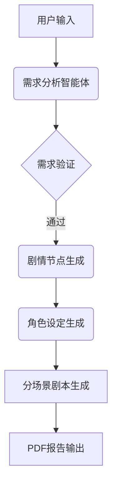

# AutoScriptCraft - 智能剧本生成系统


## 项目简介

AutoScriptCraft 是一个基于多智能体协作的自动化剧本生成系统，通过模块化的工作流程实现从用户需求到完整剧本的端到端生成。系统采用线性流程设计，包含需求分析、剧情构建、角色塑造、剧本生成四大核心模块，每个模块由专业化的AI智能体负责，最终生成包含完整剧本和制作报告的PDF文档。

## 主要功能

🎭 **全流程自动化生成**
- 需求清单解析（用户意图识别与结构化）
- 多节点剧情生成（包含关键情节转折点）
- 角色档案构建（人物关系/性格/背景设定）
- 剧本对话生成（分场景剧本写作）

📊 **智能创作辅助**
- 实时Token消耗监控
- 生成进度可视化
- 剧本复杂度分析
- 多版本迭代支持

📑 **专业报告输出**
- 自动生成结构化PDF报告
- 包含需求清单/角色档案/完整剧本
- 支持中文字体排版
- 一键导出功能

## 快速开始

### 环境要求
- Python 3.8+

### 安装步骤
```bash
# 克隆仓库
git clone https://github.com/maye76/AutoScriptCraft.git

# 安装依赖
pip install -r requirements.txt
```

### 使用说明
```bash
# 使用前需确保llms文件中的yaml文件配置正确
python app.py
```
1. 访问 `http://localhost:7860`
2. 在输入框填写创作需求（示例："我需要一份黄梅戏剧本，题材不限，时间设定在古代，不需要创新元素"）
3. 点击"开始"按钮启动生成流程
4. 实时查看各模块生成内容
5. 点击"下载剧本PDF"获取完整报告

## 系统架构

### 技术栈
- **交互层**: Gradio Web界面
- **逻辑层**: YAML模块化智能体架构
- **文档层**: FPDF报告生成
- **异步处理**: asyncio事件循环

### 智能体工作流


## 开源协议

本项目采用 **AGPL-3.0 协议**：
- 允许商业使用
- 允许修改衍生
- 要求强制开源
- 保留原始署名

完整协议内容请参见 [LICENSE](LICENSE) 文件。

## 致谢

- [DeepSeek](https://www.deepseek.com/)大模型支持，如此简单的架构就能实现这样的效果，DeepSeek团队的贡献功不可没
- [Gradio](https://www.gradio.app/)交互框架
- [FPDF](https://py-pdf.github.io/fpdf2/index.html)文档生成库

---
<!-- 
**项目官网**：[autoscript.craft](https://example.com) | **联系作者**：your.email@university.edu.cn -->

*让AI助力创意表达，开启智能编剧新时代* 🎬